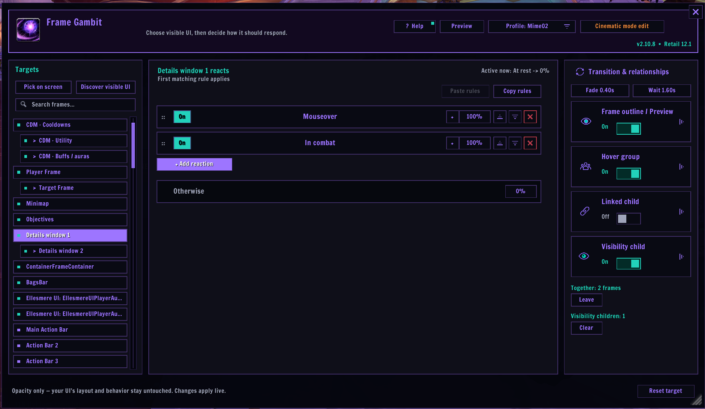
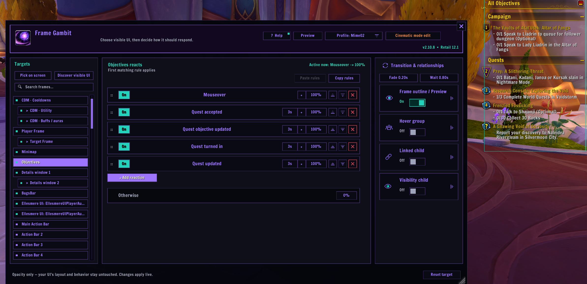
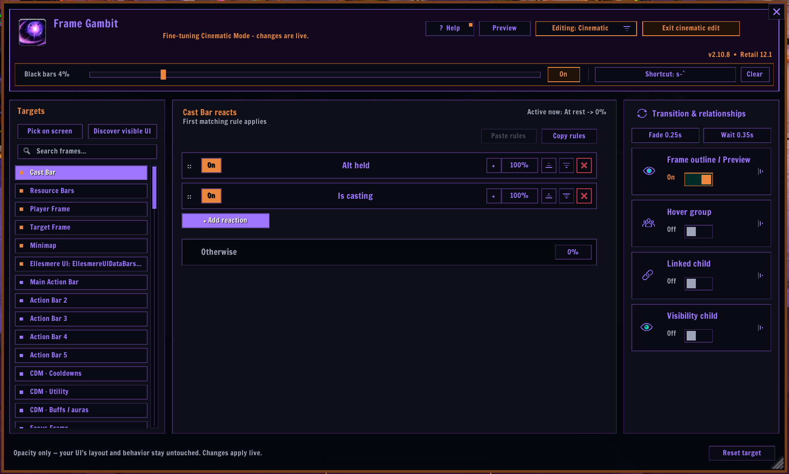
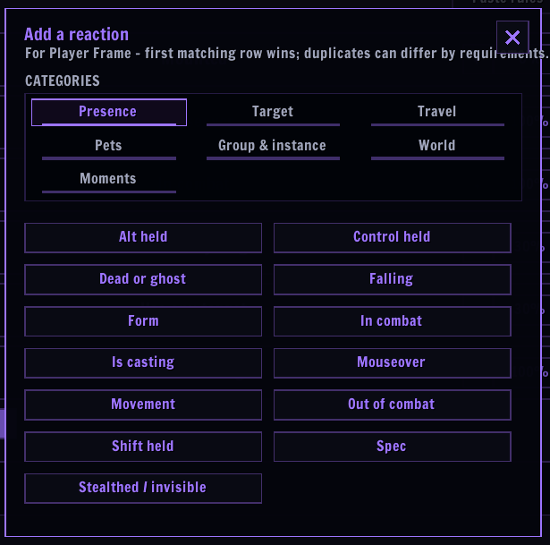
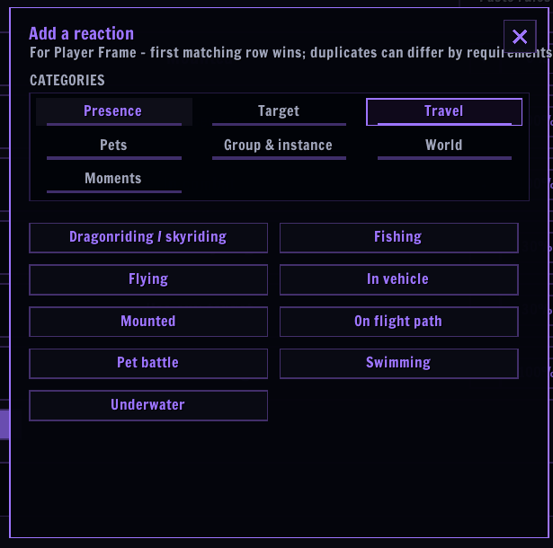
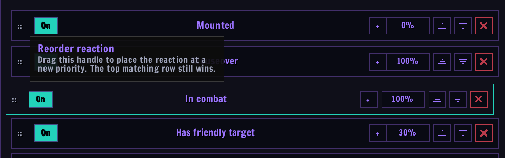

# Frame Gambit

Frame Gambit is a World of Warcraft addon by **Mimezu** for approachable, ordered frame-visibility rules. It can manage Blizzard and addon-owned UI frames while leaving their layout, styling, and gameplay behavior with the original UI addon.

Highlights include:

- ordered, first-match visibility reactions;
- composite built-in targets for split UIs such as complete Details windows;
- mouseover groups and parent/child reveal relationships;
- visual frame discovery and selection;
- a configurable Cinematic Mode for an uncluttered questing view;
- viewer-level Cooldown Manager fading that composes with EllesmereUI;
- profiles, import/export, diagnostics, and native keybinding support.

## See Frame Gambit in action

### Build ordered visibility rules



Choose a Blizzard or addon frame, stack its reactions in priority order, then
tune transitions and relationships from the same editor. The first matching
reaction wins.

### React to live gameplay moments



Frames can return for mouseover, combat, quest events, and many other useful
moments. Frame Preview makes the selected target easy to identify in-game.

### Fine-tune Cinematic Mode



Cinematic Mode has its own editable profile, black bars, and shortcut while
using the same familiar rule editor. Changes are applied live.

### Pick clear, reusable conditions

| Presence conditions | Travel conditions |
| --- | --- |
|  |  |
| Add combat, mouseover, movement, form, spec, stealth, and input conditions. | React to mounted, flying, skyriding, fishing, vehicles, swimming, and more. |

### Reorder priorities directly



Drag the whole reaction into place. The surrounding rows move out of the way
so the new first-match priority is clear before you drop it.

## Help and guided tutorial

Open **? Help** from the editor header for short explanations of the Gambit
flow, relationships, Cinematic Mode, and safe integrations. The Help window
can be moved independently, but closes with the editor. **Start guided
tutorial** launches a non-destructive walkthrough with a temporary portrait
**Tutorial Frame**, contextual spotlights, and real editor actions. Its
temporary target and lesson rules are removed when the tour ends, is skipped,
or is interrupted; your profile is never changed.

## Conditions

Reactions may use **Class pet active** for a player's combat pet (such as a
Hunter or Warlock pet), or **Cosmetic companion active** for a summoned Pet
Journal companion. These are separate conditions; Frame Gambit intentionally
does not provide an ambiguous "any pet" condition.

Picker cards use a shared, explicit **Yes / No** segment: the filled answer is
the one the row matches. **Movement: Yes** means moving; **Movement: No**
means stationary. Use **Form** to choose a supported gameplay form and then
whether it should be active (**Yes**) or inactive (**No**). Form rows for
another class/spec remain saved but are visibly muted and skipped, so one
profile can cover multiple specs. Available choices are Druid forms,
Shadowform, Ghost Wolf, and Demon Hunter Metamorphosis (including Devourer
Void Metamorphosis). Configurable cards
are repeatable: add as many as needed, then order them like any other gambit.
The **Spec** card first chooses a class, then its spec; other-class rows are
retained, greyed out, and skipped so a shared profile can cover alts or future
spec changes.
The presence list also includes **Stealthed / invisible**; travel includes
**Fishing**; and Group & instance includes **In Delve**.

Every reaction row has an **On/Off** switch. Off rows stay in their place with
their complete setup intact, but never match until turned back on.

## Sharing profiles

Profile exports are portable between different UI setups. On import, Frame
Gambit resolves each stable target through the recipient's own Blizzard and
addon adapters. Targets that do not exist on that installation are skipped,
along with relationships that depended on them; compatible targets and rules
still import normally. The import result reports how many targets were kept
and how many unavailable targets were skipped.

## Installation

[**Download the latest install-ready ZIP**](https://github.com/Mimezu/PriorityFader/releases/latest/download/FrameGambit.zip)

The release ZIP contains the `FrameGambit` addon and the small
`PriorityFader` migration bridge for existing users.

Place this folder at:

```text
World of Warcraft/_retail_/Interface/AddOns/FrameGambit
```

Reload the UI, then open the addon with:

```text
/framegambit
/fg
```

## Updating from Priority Fader

The transition ZIP contains **two folders**: `FrameGambit` and a tiny
`PriorityFader` settings bridge. Extract both of them. The bridge loads your
existing `PriorityFader.lua` data and gives it to the new addon before login.
Your profiles, targets, reactions,
relationships, Cinematic configuration, tutorial progress, and Cinematic
shortcut are retained.

1. Exit World of Warcraft completely.
2. Extract **both** folders from the Frame Gambit transition ZIP, replacing the
   old `PriorityFader.toc` with the small migration bridge.
3. **Do not delete SavedVariables.** Start the game and the conversion happens
   automatically.

`/pfader`, `/priorityfader`, and the old integration API remain as quiet
compatibility aliases for existing macros and addon integrations. New use
should prefer `/fg` and `FrameGambitAPI`. After the migration release is no
longer needed, the bridge folder can be removed safely.

## Design boundary

Frame Gambit is an alpha-only presentation layer. It does not rewrite another addon's saved settings, reparent its frames, or replace its styling. See [MIGRATION.md](MIGRATION.md), [INTEGRATION.md](INTEGRATION.md), [ROADMAP.md](ROADMAP.md), and [TESTING.md](TESTING.md) for migration, integration contracts, current limitations, and the release test matrix.

## Releases

GitHub publishes an install-ready ZIP for milestone releases. The permanent
[latest release page](https://github.com/Mimezu/PriorityFader/releases/latest)
always points to the newest public build.
